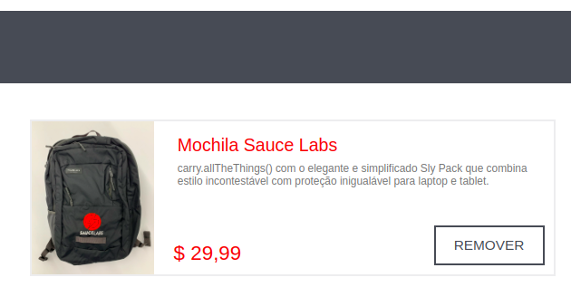

# Bug Report - Não é possível adicionar mais de uma unidade do mesmo produto no Catálogo

## Descrição
Ao tentar adicionar mais de uma unidade do mesmo produto no carrinho, **não há opção para ajustar a quantidade**, o botão "Add to cart" muda para "Remove" imediatamente.

---

## Passos para Reproduzir

1. Acessar a página de login do Swag Labs;
2. Logar com o usuário: `standard_user` e senha: `secret_sauce`;
3. Na tela de **Catálogo de Produtos**, clicar no botão de **"Add to cart"** para qualquer produto;
4. Observar que o botão muda para **"Remove"**, **sem opção de adicionar mais unidades** do mesmo item.

---

## Resultado Esperado
Exibir uma opção para **adicionar múltiplas unidades** do mesmo produto ao carrinho de compras, como:
- Um seletor de quantidade;
- Botão de "+" para incremento;
- Campo de entrada de número.

---

## Resultado Encontrado
Apenas é possível adicionar **uma única unidade** do produto. O botão muda para "Remove", **sem alternativa de aumentar a quantidade** diretamente no catálogo.

---

## Ambiente de Testes
- Ambiente: `dev`

---

## Prioridade
**Alta**

---

## Tipo de Teste
- Teste de **Melhoria**

---

## Evidencia
