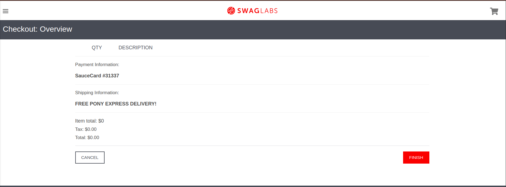

# Bug Report - Compra sem produto no carrinho

## Descrição
Usuário consegue finalizar uma compra mesmo com o carrinho vazio, sem adicionar nenhum produto.

---

## Passos para Reproduzir

1. Logar com o usuário: `standard_user` e senha: `secret_sauce`;
2. Clicar no botão de carrinho e aguardar redirecionamento para a página de carrinho de compras;
3. Com o carrinho **vazio**, clicar em **Checkout**;
4. Preencher o formulário de informações (nome, sobrenome, cep) e clicar em **Continuar**;
5. Na tela de _Checkout Overview_, clicar em **Finish** para finalizar a compra.

---

## Resultado Esperado
Na tela de carrinho, deve exibir uma **mensagem de aviso** indicando que o carrinho está vazio e **não permitir o avanço** para a próxima etapa do checkout.

---

## Resultado Encontrado
Mesmo com o carrinho **vazio**, o sistema permite **avançar até o final** da compra e concluir o pedido normalmente.

---

## Ambiente de Testes
- Ambiente: `dev`

---

## Prioridade
**Alta**

---

## Tipo de Teste
- Teste de **Funcionalidade**

---

## Evidencia

