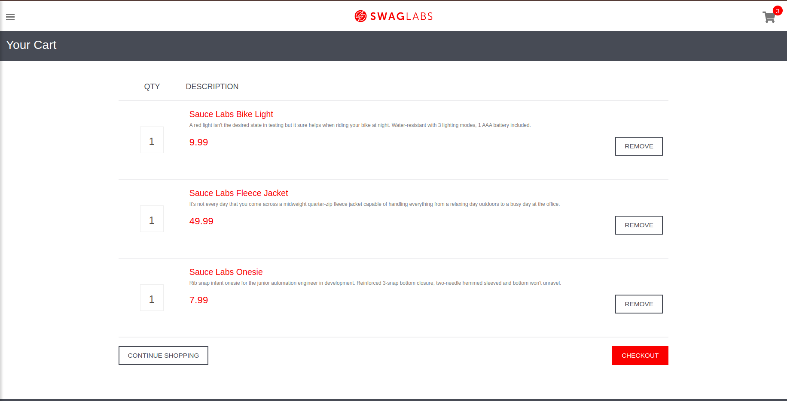

# 🐞 Bug Report - Imagem do Produto não exibida no Carrinho de Compras

## Descrição
Na tela do carrinho de compras, ao adicionar um produto, **a imagem do item não é exibida**, comprometendo a visualização completa do produto pelo usuário.

---

## Passos para Reproduzir

1. Adicionar um produto ao carrinho de compras;
2. Clicar no botão de **Carrinho** e aguardar o redirecionamento para a página de carrinho de compras;
3. Verificar a exibição do produto adicionado.

---

## Resultado Esperado
Na tela de carrinho de compras, deve ser exibido:
- Nome do produto  
- Quantidade  
- Preço  
- **Imagem do produto**

---

## Resultado Encontrado
O produto apresenta apenas a **descrição e a quantidade**, **sem exibir a imagem** correspondente.

---

## Ambiente de Testes
- Ambiente: `dev`

---

## Prioridade
**Baixa**

---

## Tipo de Teste
- Teste de **Visual / UI**

## Evidencias

