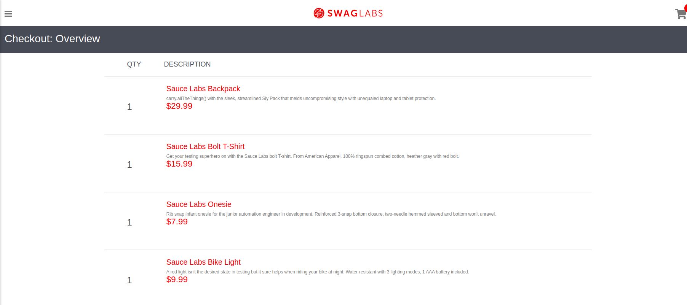

# Bug Report - Imagem do Produto não exibida no Checkout Resumo

## Descrição
Na tela de resumo da compra, a **imagem do produto não está sendo exibida**, prejudicando a visualização completa do item.

---

## Passos para Reproduzir

1. Logar com o usuário: `standard_user` e senha: `secret_sauce`;
2. Na tela de carrinho, clicar no botão de **Checkout** e prosseguir com os pedidos adicionados ao carrinho;
3. Na tela de checkout, preencher todos os campos obrigatórios (nome, sobrenome, cep) e clicar em **Continuar**;
4. Verificar as informações do **resumo da compra**.

---

## Resultado Esperado
Exibir as seguintes informações de cada produto:
- Nome  
- Quantidade  
- Preço  
- **Imagem do produto**

---

## Resultado Encontrado
A **imagem do produto não é exibida** na tela de resumo da compra.

---

## Ambiente de Testes
- Ambiente: `dev`

---

## Prioridade
**Baixa**

---

## Tipo de Teste
- Teste de **Visual / UI**

---

## Evidencia

