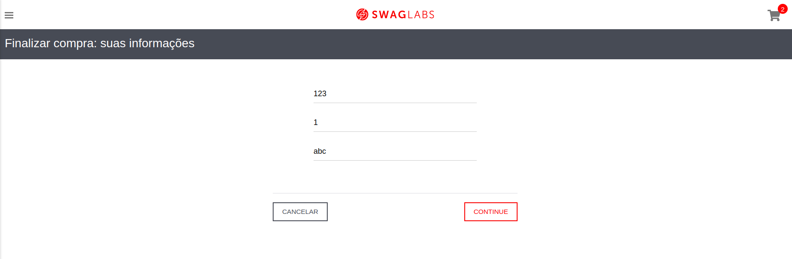

# Bug Report - Validação incorreta do campo CEP no Checkout Informações

## Descrição
Ao inserir um **CEP em formato incorreto**, o sistema **não apresenta mensagem de erro** e permite que o usuário avance para a próxima etapa do checkout.

---

## Passos para Reproduzir

1. Logar com o usuário: `standard_user` e senha: `secret_sauce`;
2. Na tela de carrinho, clicar no botão de **Checkout** e prosseguir com os pedidos adicionados ao carrinho;
3. No formulário de checkout de informações, **digitar o CEP em formato incorreto**;
4. Clicar no botão **Continuar**.

---

## Resultado Esperado
O sistema deve exibir uma **mensagem de erro**, como:
> `Erro: Código postal é inválido`

E **bloquear o avanço** para a próxima tela do checkout.

---

## Resultado Encontrado
O sistema permite o avanço para a tela de **checkout resumo de compra**, **mesmo com o CEP incorreto**.

---

## Ambiente de Testes
- Ambiente: `dev`

---

## Prioridade
**Alta**

---

## Tipo de Teste
- Teste de **Funcionalidade**

---

## Evidencias
